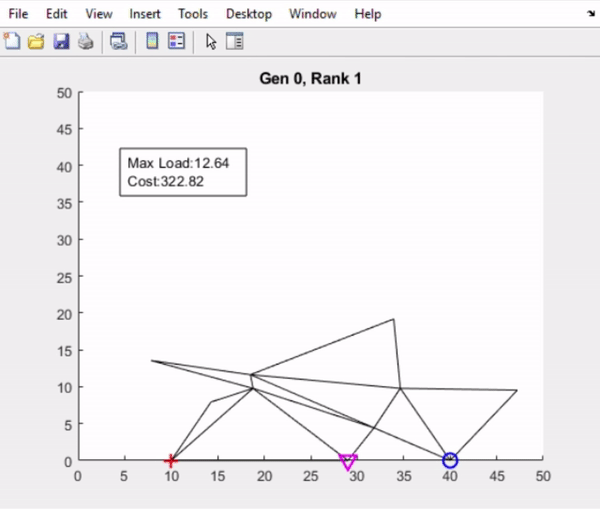
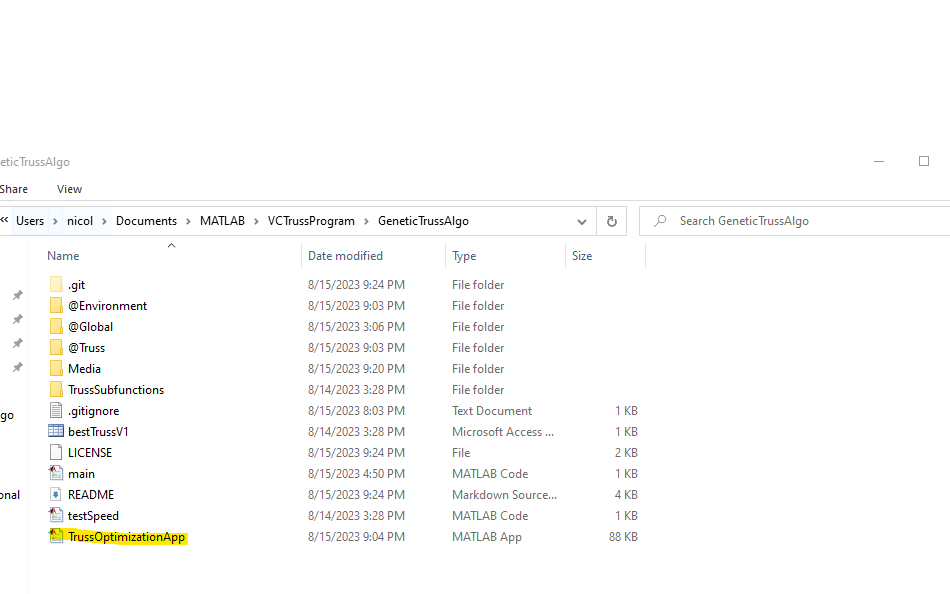
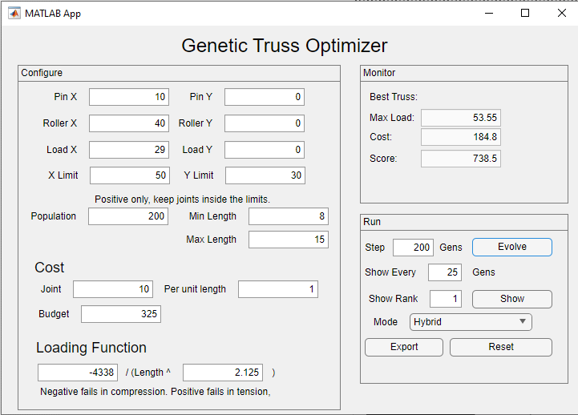
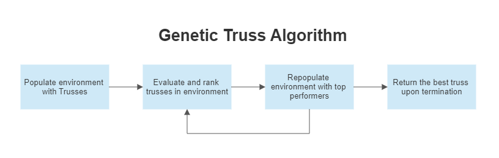
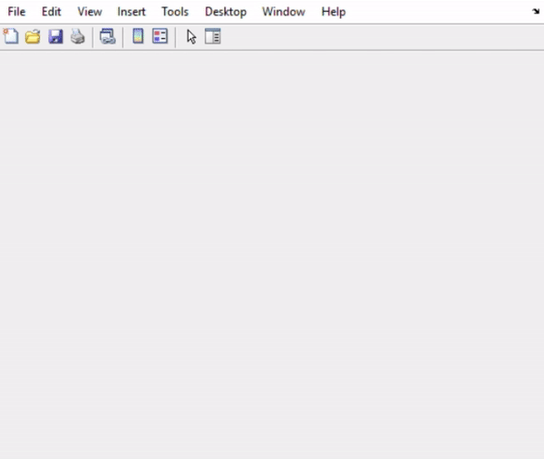
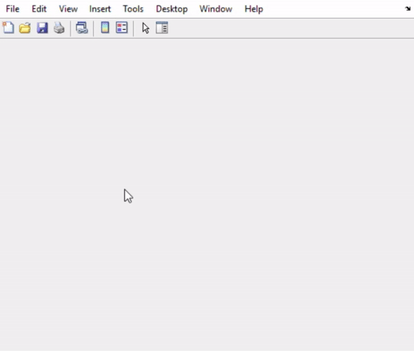
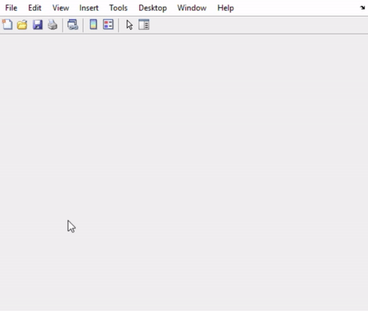
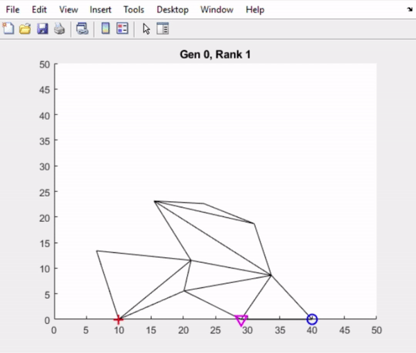

# Genetic Truss Optimizer


"+" is Pin, "o" is roller, "v" is load. 

(Video is sped up, but reflects actual truss generation capabilities)

## 1. Welcome!
Welcome to the Genetic Truss Optimizer. This is a MATLAB application/algorithm that automatically generates an optimized truss based on initial conditions that you specify, such as pin, roller, and load placement. Originally meant to satisfy my own curiosity about computational tools for engineering design, this type of algorithm may have applications in 3D printed supports if loading conditions are known and odd geometries are not a manufacturing constraint. 

## 2. How To

### 2.1 Launch the App

To launch the app, you must have [MATLAB](https://www.mathworks.com/products/matlab.html) installed on your machine. You also need the [Statistics and Machine Learning Toolbox](https://www.mathworks.com/products/statistics.html). To run the app, first clone the repository. Then click on the file titled "TrussOptimizationApp" to launch. 

```
git clone https://github.com/nmalamug/GeneticTrussAlgo.git
```


### 2.2 Enter Initial Conditions

After you opened the app, enter the initial and bounding conditions for your truss. These include the positions of the pin, roller, and load joints. 

Note: Only one load at a time is currently supported. 

The X limit and Y limit define a bounding rectangle for your truss between 0 and the specified value. **Do not enter any values below zero, and don't put your pin, roller, or load outside the bounding box.**

Also configurable are a cost function based on the number of joints/total length of all members, a critical function that specifies truss failure points, and length limits for members. **Specifying length limits does not guarantee all members will be within those limits.** Trusses are penalized for having members outside length limits, but not disqualified. 

Population can also be changed. This will impact how many trusses are simultaneously evaluated between each generation. Larger will lead to more variance and power per generation, but slower runtimes. I usually find 150-400 to be a good balance. 



### 2.3 Run the Algorithm

The "Run" box contains all of the settings that impact user experience. 

There are three modes: 

- **Hybrid** - The default mode, optimizes for truss strength, but also considers amount of material used.
- **Max Load** - Considers only max load, and attempts to construct the most strongest truss possible within the material allotment. 
- **Load/Cost** - Attempts to find the truss with the optimal load/cost ratio. 

To begin running the algorithm, click on "Evolve." You are allowed to configure the number of generations the optimizer runs for, as well as how often it shows the best design. When the optimizer is finished, you can choose to run for more generations, view less optimal trusses, reset, or export. 

### 2.4 View Truss at Rank

At runtime, the optimizer stores a variety of trusses in each generation. Some are better optimized than others. Trusses from each generation are ranked, and you can use the "Show" button with the "Show Rank" option to show other trusses in the environment. For example, entering "10" into "Show Rank" and clicking "Show" will display the 10th highest scoring truss. 

### 2.5 Export a Truss

Exporting a Truss is currently disabled. 

## 3. Analysis



### 3.1 How It Works (The Basic Idea)

The algorithm is split into two main sections: the Environment and Trusses. They can be thought of as the judge and contestants at a yearly sporting event. Judges score contestants based on their performance, and contestants come back stronger the next year after recieving feedback. 

The Environment plays the role of the judge, scoring trusses based on their performance. The Trusses are the contestants, who try to win the favor of the Environment. When a round of scoring is done, the Trusses improve after some feedback and another round begins. 

#### 3.1.1 Initializing Trusses

When an Environment is first created, the generator randomly creates a specified number of trusses. This is done by selecting points, creating a frame, and then constructing internal connections. Along the way, functions are run to validate that each Truss is a simple truss with the given initial conditions (pin, roller, load).

#### 3.1.2 Stepping a Generation

To step a generation, Trusses are simulated, scored, ranked based on an optimization function (the modes outlined in section 2). They can be scored on their maximum carrying capacity at the load joint, their cost, or both. They then see deductions based on member lengths (too short or too long), bounding box infringements, and budget overages. 

Once scoring and ranking are complete, the program keeps the highest scoring 1/4 of all trusses, replacing the others with modified copies of the high scorers. This repeats every generation until stopping conditions are met. 

### 3.2 Initial Goals

The initial goals with this project were to:
- Create a method for generating optimized structures for a given 2D static loading condition.
- Make the program usable in an application format.
- Have fun!

### 3.3 Results

This program does serve as a method for generating optimized 2D trusses for static loading conditions, but tends to get stuck in local maxima. The algorithm, therefore, is highly unlikely to reach global maxima. If substantial effort is put forth, a human will out-design this program. However, the maxima where the program gets stuck tend to be reasonably well-optimized. Partial success. 

It is also usable in an application format, even in spite of the messy user interface and need to have MATLAB open while using it. This wasn't the priority of the project, so I still consider this a success. 

I really enjoyed this project - definitely good on the last one 🎉.

## 4. ToDo
Although I've posted the project, I still feel it has a lot of untapped potential. When I come back to this project I will:
- Create speed optimizations for truss generation.
- Reuse more of the truss in generational steps.
- Decrease model tendency to get stuck in local maxima. 
- Improve app usability.
- Parallellize some processes.
- Support multiple loads and loading directions

With improvement, there are likely even ways to extend this model to 3 dimensions, prioritize creating trusses that are easier to physically build, and evaluate dynamic loading conditions. 

#### Thanks for Reading - NM.

## 5. Gallery
 

Two interesting approaches the model took to the same configuration in different runs. 



Very similar starting conditions with vastly different loading potential when failure mode is assumed to be compression. In one, pin is to the right of the roller. In the second, the pin is to the left. 



Interesting run of the flat configuration, but without numbers to back it up.

## 6. Blog
You're still here? Here are some resources to get started on simple truss analysis and genetic algorithms!
- [TutorialsPoint Introduction to Genetic Algorithms](https://www.tutorialspoint.com/genetic_algorithms/genetic_algorithms_introduction.htm)
- [Research Paper Outlining Common Methods Used in Genetic Algorithms](https://www.sciencedirect.com/science/article/abs/pii/B9780444506801500723)
- [Instructable Dealing with Simple Truss Calculations](https://www.instructables.com/Analyzing-a-Simple-Truss-by-the-Method-of-Joints/)
- [Using Linear Algebra to Solve a Simple Truss in MATLAB](https://ecs.syr.edu/faculty/glauser/mae315/es100/lec605.pdf)
- [WordPress Article About Using Linear Algebra to Solve Trusses](https://applicationanthologys16.wordpress.com/2016/02/11/truss-bridges-and-linear-algebra/)
