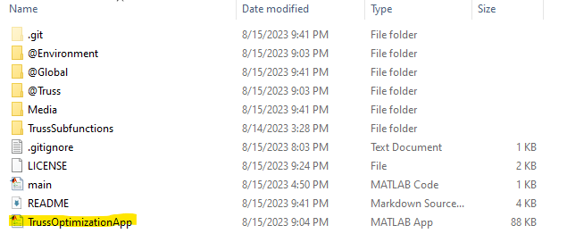

# Genetic Truss Optimizer

## 1. Welcome!
Welcome to the Genetic Truss Optimizer. This is a MATLAB application that automatically generates an optimized truss based on initial conditions that you specify, such as pin, roller, and load placement. 

## 2. How To

### 2.1 Launch the App

To launch the app, you must have [MATLAB](https://www.mathworks.com/products/matlab.html) installed on your machine. You also need the [Statistics and Machine Learning Toolbox](https://www.mathworks.com/products/statistics.html). To run the app, first clone the repository. Then click on the file titled "TrussOptimizationApp" to launch. 

```
git clone https://github.com/nmalamug/GeneticTrussAlgo.git
```


# Add picture here on which file to click on

### 2.2 Enter Initial Conditions

After you opened the app, enter the initial and bounding conditions for your truss. These include the positions of the pin, roller, and load joints. 

Note: Only one load at a time is currently supported. 

The X limit and Y limit define a bounding rectangle for your truss between 0 and the specified value. **Do not enter any values below zero, and don't put your pin, roller, or load outside the bounding box.**

Also configurable are a cost function based on the number of joints/total length of all members, a critical function that specifies truss failure points, and length limits for members. **Specifying length limits does not guarantee all members will be within those limits.** Trusses are penalized for having members outside length limits, but not disqualified. 

Population can also be changed. This will impact how many trusses are simultaneously evaluated between each generation. Larger will lead to more variance and more powerful generations, but slower runtimes. I usually find 150-400 to be a good balance. 

### 2.3 Run the Algorithm

The "Run" box contains all of the settings that impact user experience. 

There are three modes: 

- **Hybrid** - The default mode, optimizes for truss strength, but also considers amount of material used.
- **Max Load** - Considers only max load, and attempts to construct the most strongest truss possible within the material allotment. 
- **Load/Cost** - Attempts to find the truss with the optimal load/cost ratio. 

To begin running the algorithm, click on "Evolve." You are allowed to configure the number of generations the optimizer runs for, as well as how often it shows the best design. When the optimizer is finished, you can choose to run for more generations, view less optimal trusses, reset, or export. 

### 2.4 View Truss at Rank

At runtime, the optimizer stores a variety of trusses in each generation. Some are better optimized than others. Trusses from each generation are ranked, and you can use the "Show" button with the "Show Rank" option to show other trusses in the environment. For example, entering "10" into "Show Rank" and clicking "Show" will display the 10th highest scoring truss. 

### 2.5 Export a Truss

## 3. Analysis

### 3.1 How It Works

### 3.2 Initial Goals

### 3.3 Results

## 4. ToDo
Although I've posted the project, I still feel it has a lot of untapped potential. When I come back to this project I will:
- Create speed optimizations for truss generation.
- Reuse more of the truss in generational steps.
- Decrease model tendency to get stuck in local maxima. 
- Improve app usability.
- Parallellize some processes.

Notes: The model does really bad with deleting points and inserting points where a member is too long. I have ideas on how to approach these. 
